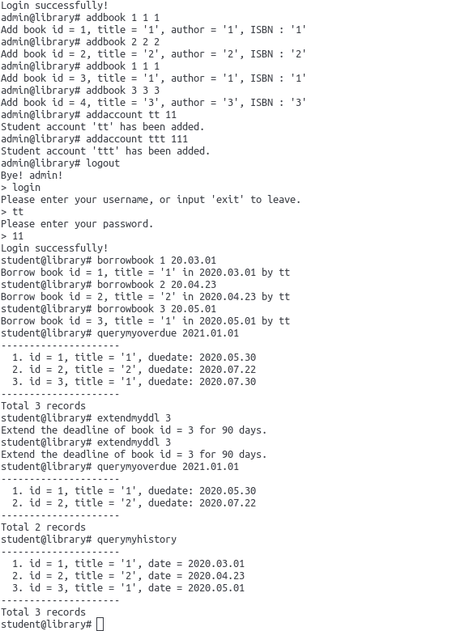

# Assignment 3 Library System Report

这是*沈溯 18307130102*实现的*复旦大学2020春季数据库引论*课程的第三次上机作业. 作业要求参照[IDBS-Spring20-Fudan-Assignment3](https://ichn-hu.github.io/IDBS-Spring20-Fudan/assignment3/readme/). 本文件是本次作业的报告. 本报告含有以下内容


1. [Introduction](#Introduction) 图书管理系统简介
2. [Build](#Build) 运行方法
3. [Guideline](#Guideline) 指令指南
4. [Sample](#Sample) 一组测试样例
5. [Others](#Other) 杂七杂八

本次作业的实现环境为


```
system: ubuntu 18.04 LTS.
go:     go version go1.14.1 linux/amd64
mysql:  Server version: 8.0.19 MySQL Community Server - GPL
```

## Introduction

在本次作业中，针对设计要求，创建了以下几张表

```sql
create table account (
	username char(16) primary key,
	password char(16),
	is_admin int,
	suspend int
);
-- 表account用于存放创建的账户. is_admin表示账户是否为管理员. suspend表示账户是否被挂起.
```

```sql
create table book (
	id int primary key,
    title char(64),
    author char(64),
    ISBN char(16),
    remove int
);
-- 表table用于存放所有的书籍. remove表示其是否被移除
```

```sql
create table borrow (
	id int,
	username char(16),
	day int,
	extend int,
	is_returned int,
	foreign key (id) references book(id),
	foreign key (username) references account(username)
);
-- 表borrow表示借阅关系. day表示存入的日期(量化为int). extend表示延长归还的次数. is_returned表示是否归还.
```

```sql
create table remove (
    id int,
    expl char(128)
);
-- 表remove表示移除的所有书籍.
```


## Build

在根目录下打开终端，运行`go run library.go`

## Guideline

### 主界面

运行`go run library.go`后可以看到以下界面，为图书管理系统的主界面


在此处支持的指令有

`enroll` : 进入管理员账户注册界面(注册时会要求键入数据库密码以验证身份. 笔者本地的密码是123456)

`login` : 进入用户登录界面

`exit` : 登出系统

`? `: 显示提示

### 登陆后的子界面


在登陆之后会呈现以上界面. 如果当前账户为管理员账户，键入指令处会显示`admin@library#`，若为学生账户，会显示`student@library# `

此时系统支持以下一系列指令

#### 通用指令

`quit`, `logout`, `exit` : 登出当前账号

#### 管理员指令

1. `addbook title author ISBN` : 向系统中添加(title, author, ISBN)的一本书
2. `addaccount username password` : 向系统中添加(username, password)的一个学生账号
3. `remove id explanation` : 向系统中移除编号为id的书，解释为explanation
4. `checkddl id username` : 询问用户username借阅的编号为id的书的归还期限
5. `extendddl id username` : 延长用户username借阅的编号为id的书的归还期限一次. 单次延长为90天. 延长次数最多为3次，超过次数则会产生报错.
6. `queryhistory username` : 查询用户username的借阅记录，系统会打印相关书名和借阅日期.
7. `querynotreturn username` : 查询用户username尚未归还的书，系统会打印书的编号和书名
8. `queryoverdue username date`  : 以date作为当前日期，查询用户username超出归还期限的记录. 系统会打印书的编号、书名和该书本应归还的期限.
9. `suspend date` : 以date为当前期限，挂起所有有3条以上超出归还期限记录的用户.

#### 学生指令

1. `querybook ins` : 查询满足条件ins的书的记录. ins是形如`title = 'idbs'`、`ISBN = '9787111544937'`、`author = 'Randal E. Bryant'`的查询命令（其实由于笔者偷懒，ins将被作为sql查询语句的where后的语句直接传递给mysql, 这样大大降低了系统的安全程度，但是为查询提供了很大的便利）. 系统会打印相关书籍的编号、书名、作者和ISBN. 注意，已经被借阅的书籍不会被打印出来. 
2. `borrowbook id date` : 设定借阅日期为date，借阅编号为id的书籍. 
3. `returnbook id` : 归还编号为id的书籍
4. `checkvalid date` : 以date作为当前日期. 如果账户被挂起，但是用户已经归还了一些书籍并使得逾期未归还(截至date日期)的书籍保持在3本及一下，使用该指令可以解除当前账户被挂起的状态.
5. `querymyhistory` : 查询自己的借阅记录
6. `querymynotreturn` : 查询自己未归还的书目
7. `checkmyddl id` : 查询自己借阅的编号为id的书的归还期限
8. `extendmyddl id` : 延长自己借阅的编号为id的书的归还期限一次
9. `querymyoverdue date` : 以date为当前期限，查询自己超过归还期限的书目

注: 指令中的date均为形如`xxxx.xx.xx`或`xx.xx.xx`类型的字符串. 此外，本系统的日期从2000.01.01开始，最高支持到2099.12.31.

特殊约定: 每本书默认的借阅时长为90天，每次延长借阅期限都会延长90天. 每本书至多只能延长3次借阅期限.

## Sample

一组样例

`enroll` `login` `exit` 


`addbook` `addaccount` `borrowbook` `extendmyddl` `querymyhistory` `querymyoverdue`



`returnbook` `querymynotreturn`


`checkmyddl`


`suspend` `checkvalid` 


## Others

由于开发时间和代码体量都超出了笔者的预期，所以在最后的调试阶段可能尚未做到面面俱到，可能依旧存在这样的那样的bug.

前期开发过程中笔者针对系统的交互性做了较为深入的思考. 在某些界面输入某些指令，系统会打印特殊的字符串，而并不是简单的"E: Invalid input.". 但是由于最后敲定的指令过多，而时间也比较有限，所以到了二级页面(登录后的子界面)，设计理念基本上就变成了能用就行了. 此外，由于设计时间跨度较长，笔者也忘了自己具体针对哪些指令实现了这一功能. 一个例子是如果你已经登录后再输入`login`

```
admin@library# login
E: Please logout first!
```

或者在学生账户下执行需要管理员权限的指令，会有以下反馈

```
student@library# removebook 1 lost
E: Cannot execute it. Are you admin?
```

等等.

此外，本系统并不像真实的图书管理系统那样有一条完整的单调的时间线，而是所有日期均依赖于手工输入. 这样设计是出于方便调试的目的. 如果真的是要做成真实的系统，实际上再在那些需要用到日期的指令外套一层壳，传入系统日期即可.

此外，在这里对一些情况做出约定

1. remove了一本未归还的书

   这这并不影响用户对该书籍的归还，虽然现实中用户并不会归还这本书. 此外，如果真的有用户归还了这本书，这并不会使这本书解除remove状态. 如果查询用户的借阅记录并且该用户借阅过被移除的书籍，记录还是会照常显示.

综上，本系统存在着对交互界面的一些斟酌和美化，但是还有很多方面并不完美.
